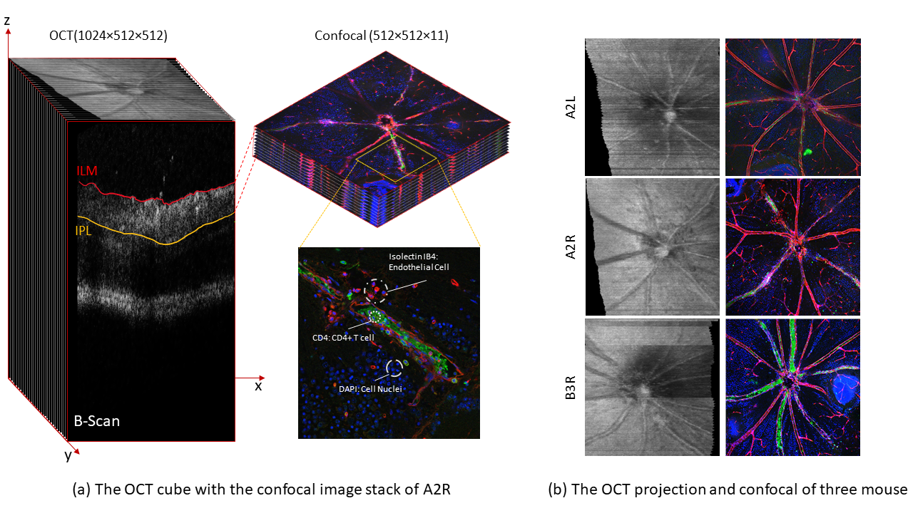

# OCT2Confocal 3DCycleGAN


## Overview
Code for ***OCT2Confocal: 3D CycleGAN based Translation of Retinal OCT Images to Confocal Microscopy (ISBI 2024)***

Xin Tian, Nantheera Anantrasirichai, Lindsay Nicholson, and Alin Achim

-[*[Paper]*](https://arxiv.org/abs/2311.10902)

## Traing Dataset Structure
The dataset is organized within the `dataset` directory, containing two subfolders: 
- `trainA`: OCT images
- `trainB`: Confocal images

Ensure the images are pre-processed as per the specifications outlined in the paper for optimal results.

## Installation
Install the necessary dependencies with the following command:

```bash
conda create --name 3dcyclegan python=3.10.4
pip install torch==2.0.1+cu117 torchvision==0.15.2+cu117 torchaudio==2.0.2+cu117 -f https://download.pytorch.org/whl/torch_stable.html
```

## Training the Model
To train the 3DCycleGAN model, execute:

```bash
python train.py --dataroot './dataset/Depth11' --name train11 --model cycle_gan --n_epochs 200 --n_epochs_decay 200 --save_epoch_freq 20 --load_size 232 --crop_size 212 --lr 0.00002
```

## Testing Trained Model
To test the 3DCycleGAN model, execute:

```bash
python test.py --dataroot './dataset/Depth11' --name train11 --model cycle_gan --load_size 212 --epoch latest
```

### Advanced Configuration
For customized training settings or modifications to the network architecture, refer to the detailed documentation.

## OCT2Confocal Dataset



### Image Acquisition and Processing

#### In-vivo OCT Images
- **Acquisition Details**: Captured using a Micron IV fundus camera with a mouse-specific lens. 
- **Resolution and Artifacts**: 1024×512×512 pixels. Artifacts may include motion, speckle noise, multiple scattering, attenuation, or beam-width artifacts.
- **Volume Scans**: Centered around the optic disc, these scans target retinal layers between the Inner Limiting Membrane (ILM) and Inner Plexiform Layer (IPL).
- **2D OCT Projections**: Created by summing in the z-direction for a comprehensive view.

#### Ex-vivo Confocal Images
- **Procedure**: Post OCT imaging, the retinas were prepared for confocal imaging using a Leica SP5-AOBS microscope.
- **Staining and Channels**: 
  - **Red (Isolectin IB4)**: Stains endothelial cells in blood vessels.
  - **Green (CD4)**: Highlights CD4+ T cells.
  - **Blue (DAPI)**: Stains cell nuclei.
  - **White (Iba1)**: Stains microglia and macrophages.
- **RGB Images**: Combinations of red, green, and blue channels for model training.

There are 22 OCT images acquired in the same manner as the primary dataset, but without corresponding confocal matches. These images are for evaluating model performance and can be further used to advance multimodal image analysis.

### Dataset Applications
The OCT2Confocal dataset can be applied to:

- **Multimodal Image Translation**: Facilitating the development of advanced algorithms for translating between different imaging modalities, thereby providing a more comprehensive understanding of retinal conditions.
- **Image Registration**: Aiding in the alignment and analysis of multimodal images, which is crucial for accurate diagnosis and treatment planning.
- **Model Training**: Offering a unique dataset for training machine learning models in tasks related to retinal health, disease diagnosis, and treatment monitoring.

## Dataset Availability
The full dataset will be released upon the publication of our paper. This release will allow researchers and practitioners full access to the dataset for their studies and applications.

## Early Access
To request early access, please email xin.tian@bristol.ac.uk. The download link will be shared post-submission.

## Citation
If you use OCT2Confocal in your research, please cite:

```bibtex
@inproceedings{tian2024oct2confocal,
  title={OCT2Confocal: 3D CycleGAN based Translation of Retinal OCT Images to Confocal Microscopy},
  author={Tian, Xin and Anantrasirichai, Nantheera and Nicholson, Lindsay and Achim, Alin},
  booktitle={IEEE International Symposium on Biomedical Imaging (ISBI)},
  year={2024},
  url={https://arxiv.org/abs/2311.10902}
}
```


<!--### Registration Form
To request early access, please fill in this [registration form](#). The download link will be shared post submission.-->

<!-- ## Citation
If you use the OCT2Confocal dataset in your research, please cite the following paper:

@article{tian2023oct2confocal,
title={OCT2Confocal: 3D CycleGAN based Translation of Retinal OCT Images to Confocal Microscopy},
author={Tian, Xin and Anantrasirichai, Nantheera and Nicholson, Lindsay and Achim, Alin},
journal={arXiv preprint arXiv:2311.10902},
year={2023}
}


For more information, refer to our publication or contact the dataset curator. -->
